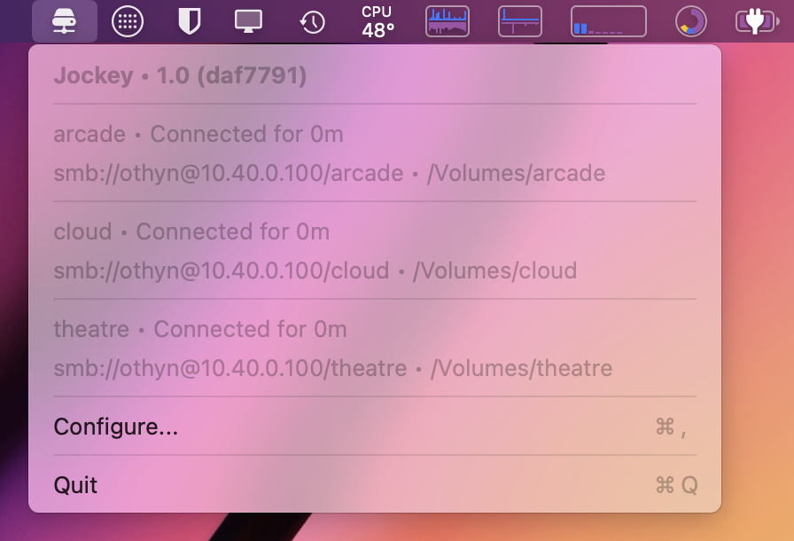

    
    <h1>Jockey for macOS</h1>
    
A simple SMB (Samba) mount keep-alive menu bar app for macOS Sequoia (15) built with ♥️ in Swift & SwiftUI.

    

    

        
        
        
        
        
        
        
        
    

    <h4>
        <a href="#floppy_disk-download">Download Latest Version</a>
         · 
        <a href="https://github.com/othyn/macos-jockey/issues">Report a Bug</a>
         · 
        <a href="https://github.com/othyn/macos-jockey/issues">Request a Feature</a>
    </h4>

 

<!-- Table of Contents -->

# :notebook_with_decorative_cover: Table of Contents

- [About the Project](#star2-about-the-project)
  - [Screenshots](#camera-screenshots)
  - [Tech Stack](#space_invader-tech-stack)
  - [Features](#dart-features)
- [Download](#floppy_disk-download)
  - [Preferences Storage](#gear-preferences-storage)
- [Contributing](#memo-contributing)
- [Changelog](https://github.com/othyn/macos-jockey/releases)
- [License](#warning-license)
- [Acknowledgements](#gem-acknowledgements)

<!-- About the Project -->

## :star2: About the Project

Jockey is a macOS menu bar utility that helps keep your SMB network shares mounted and connected, preventing the common issue of disconnections that can disrupt your workflow, or that aggravating 'Unavailable' on Plex when you've just got into bed.

Designed as an Open Source alternative to [AutoMounter](https://www.pixeleyes.co.nz/automounter/).

<!-- Screenshots -->

### :camera: Screenshots

    

<!-- TechStack -->

### :space_invader: Tech Stack

<ul>
    <li>Swift</li>
    <li>Swift UI</li>
</ul>

<!-- Features -->

### :dart: Features

- **Menu Bar Integration**: Runs efficiently in the menu bar with minimal resource usage
- **Connection Status**: Shows connection status and uptime for all configured shares
- **Auto-reconnect**: Automatically attempts to reconnect shares when they disconnect
- **Configurable Polling**: Set how frequently Jockey checks connection status
- **Custom Mount Points**: Configure shares with specific mount points
- **System Integration**: Detects existing system SMB mounts

#### Usage

1. Launch Jockey, and it will appear in your menu bar
2. Click the menu bar icon to see the status of your shares
3. Open Settings to add or manage SMB shares
4. Adjust the polling interval to control how often Jockey checks your connections

<!-- Download -->

## :floppy_disk: Download

**Download for macOS Sequoia (15) and higher:** [v1.0.0](https://github.com/othyn/macos-jockey/releases/download/v1.0.0/Jockey.zip)

### Using the app for the first time

When first using the app, you will need to right click the app and click 'Open', then on the macOS popup window select 'Open' again to trust this version of the app going forward. This is as at the moment I don't have a paid Apple developer account in order to notarize the app.

#### First time use for macOS Sequoia (15) users

If you are using macOS Sequoia, there are increased barriers in place to stop you running un-notarized apps. To open the app you will need to do the following;

1. Try to open the app, and when presented with the options to 'Move to trash' or otherwise, close out of that prompt.
2. Head over to System Settings > Privacy & Security > Security, and scroll all the way at the bottom, you should see the following:

    

3. Click on the 'Open Anyway' button.
4. When prompted with the following dialogue, click 'Open Anyway':

    

5. Head back to the Jockey app and try opening it again, it should now work as normal.

### When updating the app, does the permission screen get stuck even though you've given it permission?

There can sometimes be an issue with this, I'm not entirely sure why this occurs, as the bundle identifier for the app remains the same and therefor the granted permissions shouldn't either. MacOS gets 'stuck' thinking the app has permissions when it doesn't and so the permission splash screen for the app will never go away. **To fix it,** click the minus button at the bottom of the list of apps under macOS's Accessibility settings where Jockey is listed to manually remove Jockey from the list of permitted apps. Close Jockey and re-open it and grant it access once again, which should fix the issue. [More detail can be found in the thread for Issue #64](https://github.com/othyn/macos-jockey/issues/64#issuecomment-1615933048).

**For more downloads**, checkout the [releases page](https://github.com/othyn/macos-jockey/releases) for app downloads of any version you want to use, even pre-release builds too.

<!-- Contributing -->

## :memo: Contributing

See the [contribution guide](CONTRIBUTING.md) on how to get started. Thank you for contributing!

Detailed within that guide are steps on how...

- ... issues should be used.
- ... to setup the project.
- ... to contribute new languages via the app's localisation support.
- ... branches should be used.
- ... commits should be formatted.
- ... pull requests should be submitted.
- ... the build process works and the automation that drives it.

<!-- License -->

## :warning: License

Distributed under the MIT License. See [LICENSE](https://github.com/othyn/macos-jockey/blob/main/LICENSE) for more information.

<!-- Acknowledgments -->

## :gem: Acknowledgements

Useful resources and libraries that have been used in the making of this project.

- Readme: [shields.io](https://shields.io/)
- Readme: [ikatyang/emoji-cheat-sheet](https://github.com/ikatyang/emoji-cheat-sheet)
- Readme: [Louis3797/awesome-readme-template](https://github.com/Louis3797/awesome-readme-template)
